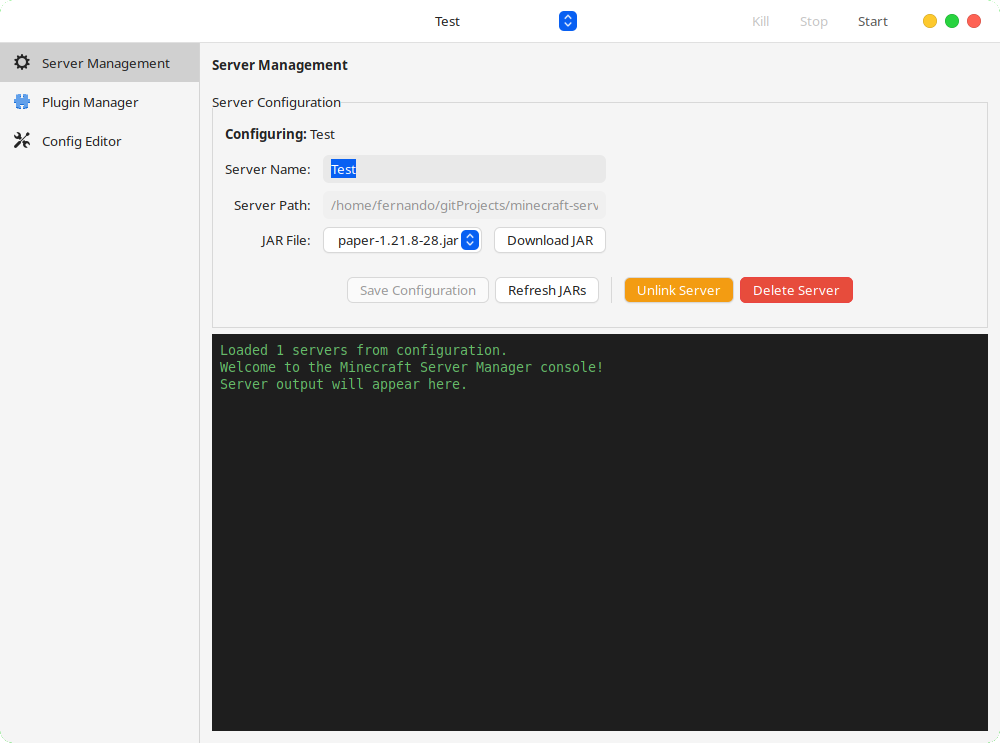
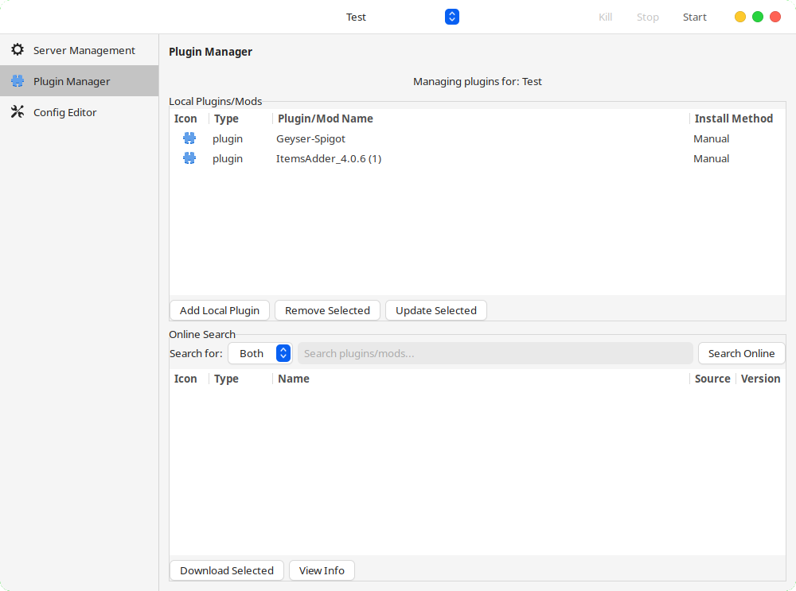
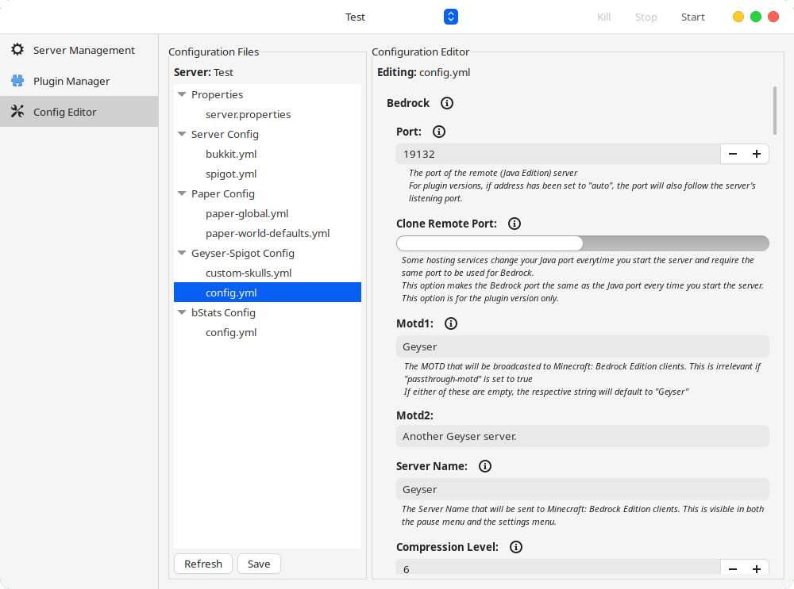

# Minecraft Server Manager GTK

A GTK-based graphical application for managing Minecraft servers with plugin and mod support.


## Features

- 🎮 **Server Management**: Create, start, stop, and configure Minecraft servers
- 🔌 **Plugin & Mod Management**: Browse, download, and manage plugins from Modrinth
- 🎨 **Colorized Console**: Real-time server output with syntax highlighting
- ⚙️ **Configuration Editor**: Visual editor for YAML/YML server configuration files
- 📥 **Automatic Downloads**: Download server JARs and plugins with ease
- 🔍 **Smart Search**: Search and filter plugins vs mods with type detection
- 🖼️ **Visual Icons**: Display plugin/mod icons from Modrinth
- 📊 **Metadata Tracking**: Track installation methods and sources

## Screenshots

**Server Management**


**Plugin Management**


**Configuration Editor**


## Installation

### From Flathub (Recommended)
```bash
flatpak install flathub io.github.fernandomema.MinecraftServerManager
```

### From Source
```bash
git clone https://github.com/fernandomema/minecraft-server-manager-gtk.git
cd minecraft-server-manager-gtk
python3 main.py
```

### AppImage
Build a portable AppImage (self-extracting executable):

```bash
# Build the AppImage
./build-appimage.sh
```

The script creates a self-extracting portable executable that:
1. Contains all application files
2. Checks for required system dependencies
3. Runs without installation on most Linux distributions

**System Requirements for AppImage:**
- Python 3
- PyGObject (python3-gi)
- GTK 3
- PyYAML (python3-yaml)

The resulting `minecraft-server-manager-gtk-x86_64.AppImage` can be distributed and run directly.

## Dependencies

- Python 3.6+
- PyGObject (GTK 3.0)
- PyYAML
- Java 8+ (for running Minecraft servers)

## Project Structure

The project follows MVC (Model-View-Controller) architecture:

```
minecraft-server-manager-gtk/
├── main.py                     # Application entry point
├── models/                     # Data models
│   ├── server.py              # Server model
│   └── plugin.py              # Plugin/mod model
├── views/                      # User interface
│   ├── main_window.py         # Main window
│   ├── server_management_page.py  # Server management tab
│   ├── plugin_management_page.py  # Plugin management tab
│   ├── console_manager.py     # Server console
│   └── ...
├── controllers/                # Business logic
│   ├── server_controller.py   # Server operations
│   ├── plugin_controller.py   # Plugin/mod operations
│   └── download_controller.py # Download management
└── utils/                      # Utilities
    ├── constants.py           # Application constants
    └── file_utils.py          # File operations
```

## Usage

### Server Management
1. Click "Add Server" to create a new server
2. Choose server type (Paper, Spigot, etc.)
3. Configure server settings
4. Start/stop servers from the interface

### Plugin Management
1. Switch to the "Plugin Management" tab
2. Search for plugins/mods using the search bar
3. Filter by type (Plugin or Mod)
4. Click download to install directly to your server

### Console
- View real-time server output with colorized text
- Auto-scrolling console for latest messages
- Dark theme for better readability

## Contributing

Contributions are welcome! Please feel free to submit a Pull Request.

## License

This project is licensed under the MIT License - see the [LICENSE](LICENSE) file for details.

## Support

If you encounter any issues or have suggestions, please [open an issue](https://github.com/fernandomema/minecraft-server-manager-gtk/issues) on GitHub.
